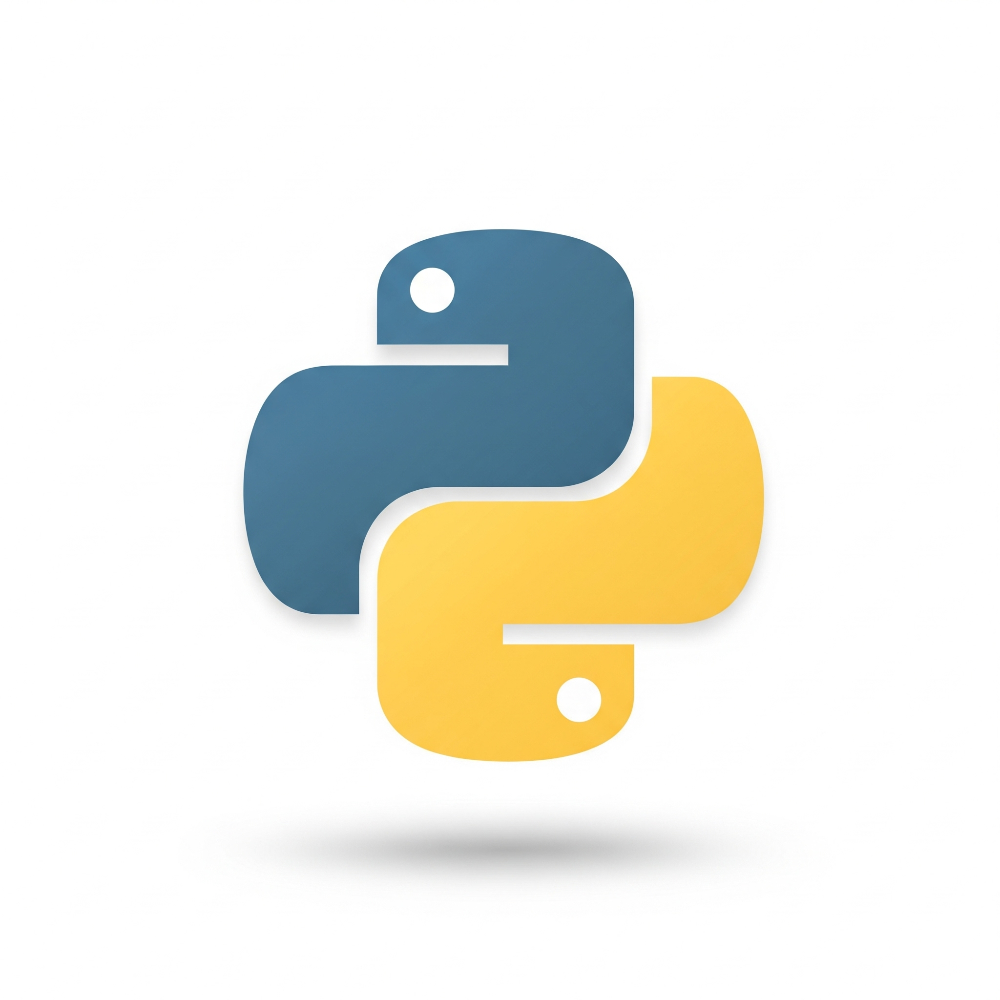

# Anotações e Projetos - Python 3+ 🐍

Este é um registro das minhas anotações e códigos durante o curso de Python 3+ na Udemy, focado em aprimorar minhas habilidades em diversas áreas.

### Tópicos Abordados

-   **PySide6:** Criação de interfaces gráficas.
-   **Django:** Desenvolvimento web com o framework.
-   **Selenium:** Automação de tarefas na web.
-   **Regexp:** Expressões regulares para manipulação de texto.
-   **Testes e TDD:** Práticas de testes automatizados e Desenvolvimento Orientado a Testes.
-   **POO e Design Patterns (GoF):** Conceitos avançados de Programação Orientada a Objetos.
-   **Algoritmos:** Estruturas de dados e resolução de problemas.

Espero que este material seja útil para mim e para qualquer pessoa que também esteja estudando esses tópicos.

